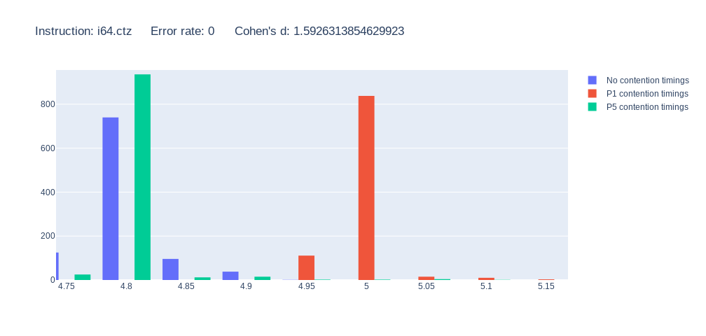
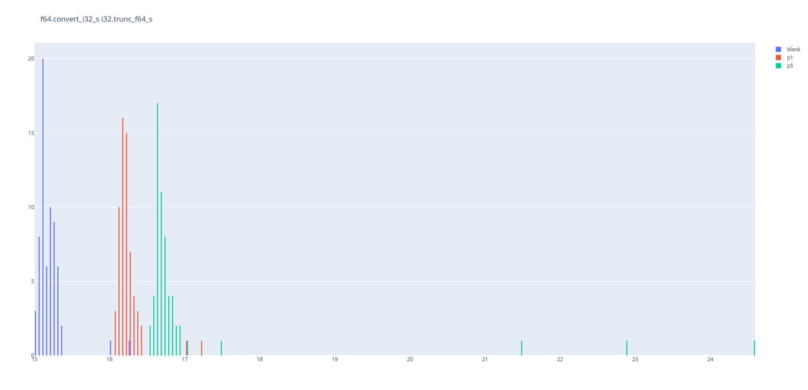
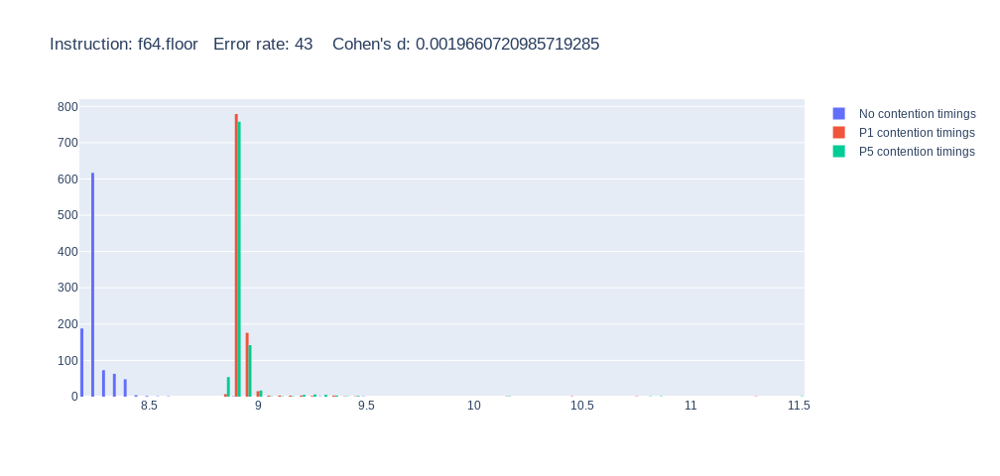

# Port Contention Goes Portable: The Code!
This repository contains code related to the paper Port Contention Goes Portable: Port Contention Side Channels in Web Browsers. It is a joint work by Thomas ROKICKI (Univ Rennes, CNRS, IRISA), Clémentine MAURICE (Univ Lille, CNRS, Inria), Marina BOTVINNIK (Ben-Gurion University of the Negev) and  Yossi OREN (Ben-Gurion University of the Negev).

This work was accepted at AsiaCCS 2022. For more details, refer to the paper [here](https://people.irisa.fr/Thomas.Rokicki/publications/wpc.pdf)

## Prerequisites

### Hardware and Software

This attack only work on Intel's CPU with SMT.
Under Linux, you can check your cpu information by typing `cat /proc/cpuinfo`.
The name of the processor is on the _model\_name_ field.

The implementation currently only works on Linux OS.
Although the attack is portative, the native code we use to handle threads is linux dependant.

All the Python code is designed for Python3!

### Dependencies
To install the dependencies, please run the following command (adapt it with you packet manager)

```
sudo apt update
sudo apt install stress
sudo apt install wabt # Right now, apt's wabt does not support vectorial instructions, so if you need them (mainly for PCD), you should get it directly from the sources.
sudo apt install python3-pip
sudo pip3 install -r requirements.txt
```

To automate the browser with selenium, you also need to download the appropriate webdriver:

* [Chromedriver](https://chromedriver.chromium.org/downloads): For Chromium based browsers
* [Geckodriver](https://github.com/mozilla/geckodriver/releases): For firefox based browsers

Dont forget to set them in path !
If you have a terminal set in the folder containing the browser, you can run
```
export PATH=$PATH:$(pwd)
```
This will only add it to the path for this current bash session!
### Running the server

To run the experiments, you need to setup the local server.
To do so, run
 ```
 python3 server.py
 ```

 You can then access it in this URL: [http://localhost:8000/](http://localhost:8000/)
## WASM-generator

This tools create wat files (WebAssembly Text format) to be compiled and used for further experiments.
Here is the list of parameters:


| short  | long    |       help                  | values | default |
| :----: |:-------:| :--------------------:|:------:| :-----: |
| -l    | --lines | Number of instructions (or pair) in the text format. |   Int  | 1,000,000   |


## PC-Detector

PC-Detector is an automated tool to detect which WebAssembly instructions can cause port contention.
It automates the browser by using Selenium.
It tests 100 different instructions for contention on port 1 or 5 (now supports ports 0, 23 and 6!).

Warning: Some new instructions, namely vectorial instructions, require a more recent version of wat2wasm (from wabt) than the one available on apt.
You can manually download and build it from [here](https://github.com/WebAssembly/wabt)
### How to use
You can run it with the following command in the PC_Detector folder:
```
mkdir build
python3 wasm_generator.py # Generates the Web assembly text files for all instructions, it can take a while
make # build the native components
make pcd # Compile the wat files to wasm
python3 pc_detector.py -t
```

This will test the instructions on firefox (by default) and output them in a json file, typically called _pcd\_firefox\_i5-blahblah.json_

PC-Detector accepts several different parameters:

| short  | long    |       help                  | values | default |
| :----: |:-------:| :--------------------:|:------:| :-----: |
| -t    | --test | Test all supported instructions and outputs result in the output file. |    -   | False   |
| -p     | --plot | Plot all graphs in the output file. |    -    | False   |
| -s    | --stats | Test all supported instructions and outputs result in the output file. |    -   | False   
| -b     | --browser | Select evaluated browser. |    chrome / firefox   | firefox   |
| -o    | --output | Json input/output file. |    String   | results.json  |

For instance, you can plot histograms for all instructions by running:

``` python3 pc_detector.py -p -o pcd_firefox_i5-blahblah.json```.

Similarly, you can get stats about instructions creating port contention by running:

``` python3 pc_detector.py -s -o pcd_firefox_i5-blahblah.json```.

### Results

#### Stats

The -s flags prints stats about instructions creating contention.
We consider that an instruction creates contention when the error rate between P1 and P5 is less than 5%.

Here is a standard line about an isntruction creating contention:

``` i64.ctz: Suspected contention: P1        Error rate: 0   Cohen's d: 1.6511422910073639 ```


#### Histograms

To specifically check an instruction, you can use PC-Detecor to plot a histogram representing the execution times of the instruction while creating contention on port 1, port 5 or doing nothing.

An instruction creating contention on a port 1 will have a P1 distribution separated from the others, typically with higher values:




Similarly, an instruction creating contention on port 5 will have a P5 distribution with higher values than the two other distributions:



An instruction not creating contention will have a P1 and P5 values mixed, with a similar average:




## Covert Channels

We built a covert channel, running from native to the browser.
Our channel is a half-duplex asynchronous channel, and both the native (sender) and web (receiver) components emit and receive data to handle synchronization.
You can find more information on our protocol in the paper.

### How to use

To run the covert channel, you need to launch the  native sender as well as the web receiver.
You will need a terminal and a web browser.

In the terminal, go to the covert channel folder. Then, you can run

```
mkdir build
python3 wasm_generator.py
make
./build/covertChannel
```

This will start the sender. At initialization, the sender waits for a request from the receiver.
To run the receiver, you need to start the server and go to [http://localhost:8000/covert_channel/covert-channel.html](http://localhost:8000/covert_channel/covert-channel.html)
This page contains all the js and wasm code to run the receiver part of the covert channel.

To run the covert channel, either press the _start_ button or run initCovertChannel() in the console.
Either way, having the console open can be useful to retrieve some information, especially to debug.

After the run, information about the transmission will be displayed in the browser's console.

## Artificial Example

The artificial example is a simplification of a side-channel attack.
In this scenario, a branch is chosen by the native victim according to a secret.
The attacker can then guess the secret based on the different port usage of the victim.
This also let us determine the spatial resolution of the attack, i.e. the lowest number of instructions we can detect.

To run it, you need to run the following commands:

```
mkdir build
make
./build/toy_example
```


# Acknowledgement
Some code from this repository, mainly the native component of port contention, are based on Aldaya et al code, available [here](https://github.com/bbbrumley/portsmash)
